# Тестування працездатності системи

Тестування системи проводилось за допомогою застосунку Postman

## Створення файлу з даними
### Успішне створення
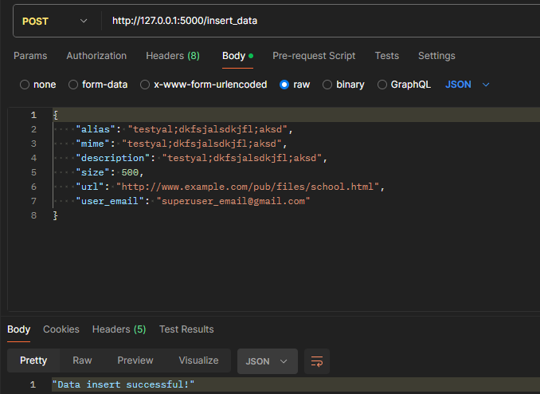
### Неуспішне створення
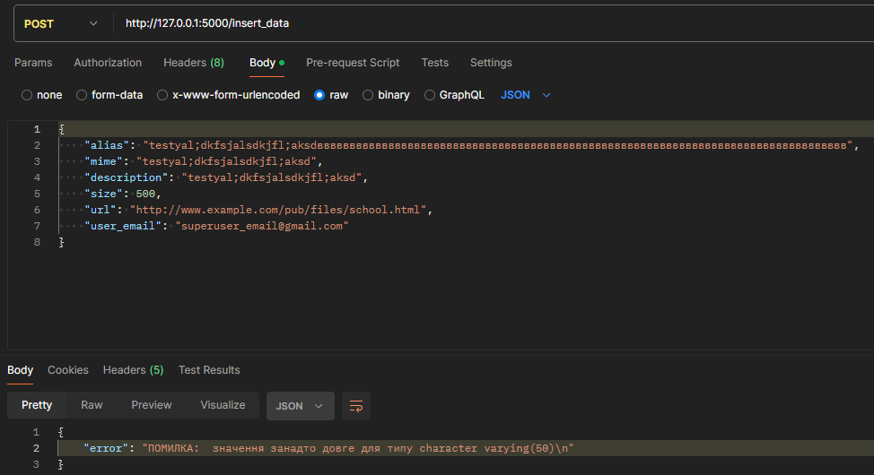
### Успішна зміна даних
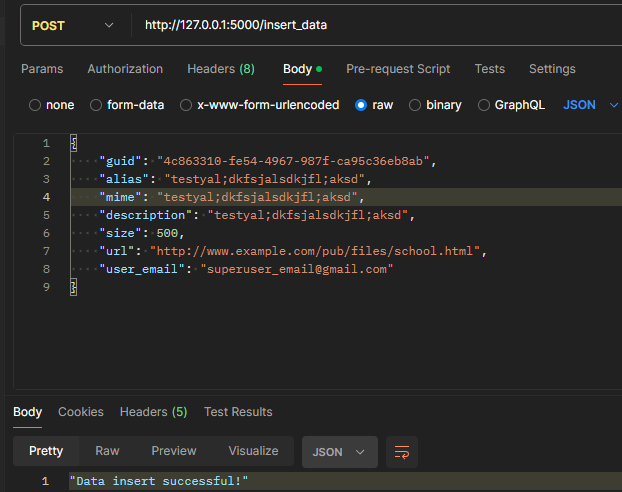
### Неуспішне зміна даних
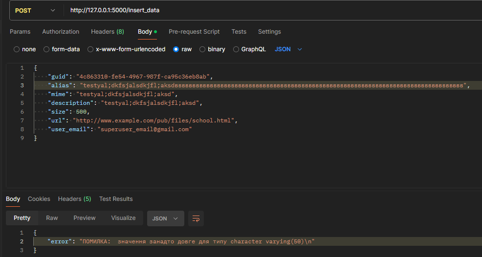

## Отримання даних
### Отримання всіх даних
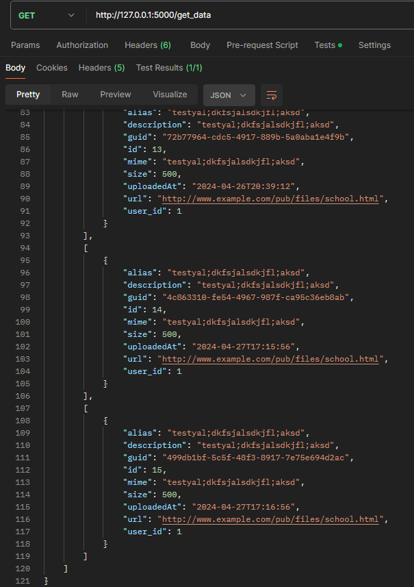
### Успішне отримання інформації про файл
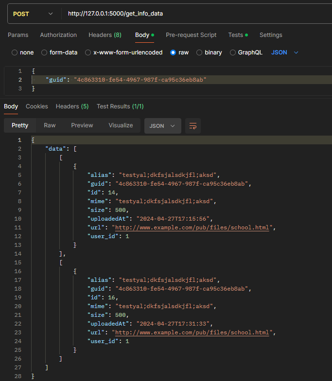
### Неуспішне отримання інформації про файл
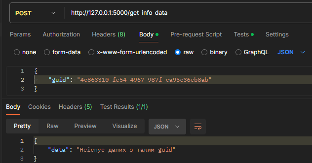
### Успішне отримання опису файлу
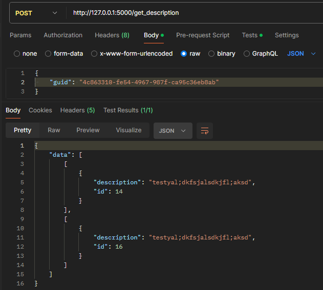
### Неуспішне отримання опису файлу
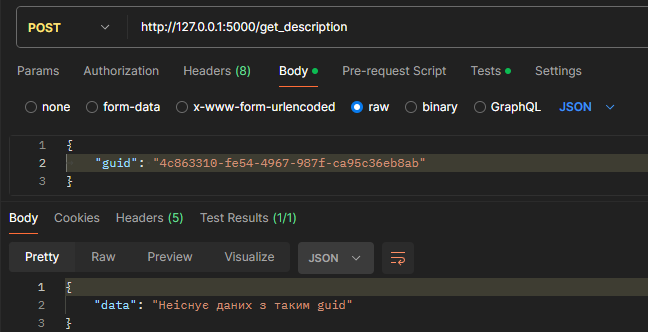

## Видалення файлу
### Успішне видалення версії файлу
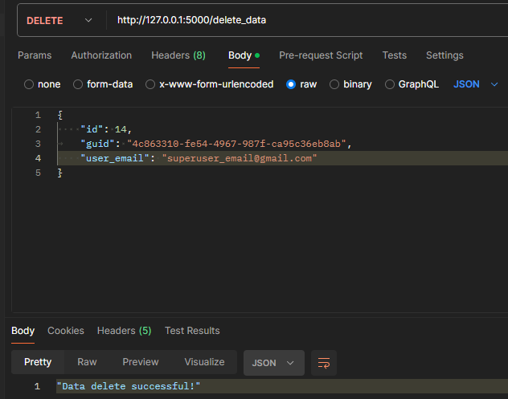
### Неуспішне видалення версії файлу
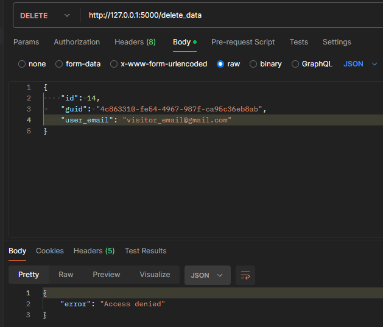
### Успішне видалення всіх версій файлу
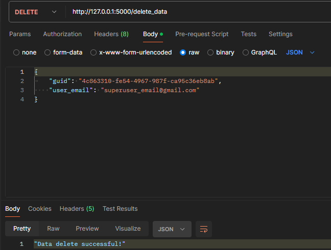
### Неуспішне видалення всіх версій файлу
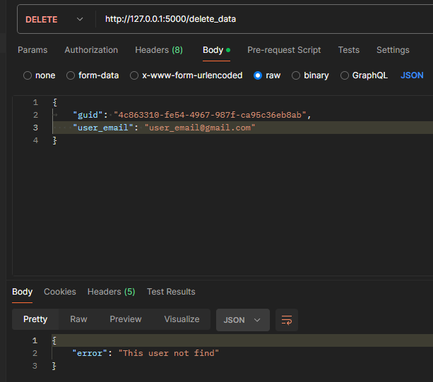
